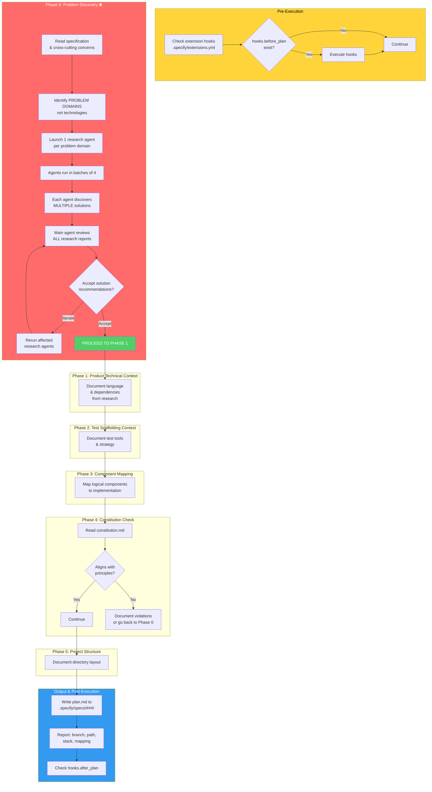

<!-- Source: spec-as-code -->
## User Input

```text
$ARGUMENTS
```

You **MUST** consider the user input before proceeding (if not empty).

## Pre-Execution Checks

**Check for extension hooks (before planning)**:
- Check if `.specify/extensions.yml` exists
- If exists, read and look for `hooks.before_plan` entries
- Filter out disabled hooks
- Execute optional/mandatory hooks as appropriate

## Overview

You are creating an implementation plan at `.specify/specs/[###-feature-name]/plan.md`.

**CRITICAL CHANGE**: The Technical Context is now split into TWO parts:
1. **Product Technical Context**: The technology stack for the feature
2. **Test Scaffolding Technical Context**: The tools to test the feature end-to-end

**ANOTHER CRITICAL CHANGE**: Research is PROBLEM-SPACED, not SOLUTION-SPACED. You identify PROBLEM DOMAINS first, then research what solutions exist. You do NOT propose technologies and then validate them.

## Execution Flow



### Phase 0: Problem Discovery (MANDATORY - DO NOT SKIP)

**⛔ STOP: You MUST discover and research ALL problem domains BEFORE writing any plan content or reading any project files.**

**🚨 VIOLATION: Reading spec files, directory structure, or any code BEFORE completing Phase 0 research is a DIRECT VIOLATION of this procedure.**

```
┌─────────────────────────────────────────────────────────────────────────────┐
│              ⛔ PROBLEM DISCOVERY GATE - MUST COMPLETE FIRST ⛔                  │
├─────────────────────────────────────────────────────────────────────────────┤
│                                                                              │
│  1. IDENTIFY PROBLEM DOMAINS (NOT TECHNOLOGIES)                            │
│     Read the specification and identify WHAT problems need to be solved:       │
│     - Data Persistence: What data must be stored and how?                    │
│     - User Interface: How is information displayed to users?                  │
│     - API Communication: How do components exchange data?                     │
│     - Background Processing: What work happens asynchronously?                │
│     - Observability: What needs to be logged, monitored, traced?             │
│     - Configuration: How is behavior customized without code changes?         │
│     - Security: What access controls and data protection are needed?          │
│     - etc.                                                                   │
│     DO NOT name any technologies. Just describe the problems.                 │
│                    ↓                                                         │
│  2. LAUNCH ONE RESEARCH AGENT PER PROBLEM DOMAIN                            │
│     • ONE agent per problem domain, NO grouping                              │
│     • If 5 problem domains → launch 5 agents                                │
│     • If 8 problem domains → launch 8 agents                                │
│     • Run max 4 agents at a time. Wait. Repeat with next batch.             │
│                    ↓                                                         │
│  3. EACH RESEARCH AGENT DISCOVERS MULTIPLE SOLUTIONS                        │
│     Phase 1: EMPATHIZE - Understand the problem deeply                       │
│     Phase 2: DEFINE - Requirements & constraints for solving this problem    │
│     Phase 3: IDEATE - Discover MANY potential solutions (not validate one!)  │
│     Phase 4: PROTOTYPE - Evaluate and recommend best-fit solutions           │
│                    ↓                                                         │
│  4. MAIN AGENT reviews ALL research reports                                 │
│                    ↓                                                         │
│  5. DECISION: Accept recommendations OR iterate with changes                │
│     • If changes → back to step 2 (rerun affected research agents)            │
│     • If accepted → THEN proceed to Phase 1                                 │
│                                                                              │
└─────────────────────────────────────────────────────────────────────────────┘
```

#### STEP 1: IDENTIFY PROBLEM DOMAINS

**Before ANYTHING ELSE, identify the problem domains from the specification.**

**Rules:**
1. **Describe problems, not solutions** - Say "data persistence" not "PostgreSQL"
2. **Be exhaustive** - Consider all aspects of the specification
3. **Cross-cutting concerns are problem domains** - Logging, Error Handling, Data Persistence, Security

**List format:**
```markdown
## Problem Domains Requiring Research

1. **[Problem Domain]** - [What problem must be solved, from spec]
2. **[Problem Domain]** - [What problem must be solved, from spec]
...
```

**Example (NOT exhaustive):**
```markdown
## Problem Domains Requiring Research

1. Data Persistence - User state must survive browser sessions and server restarts
2. User Interface - Users need to view and interact with their task lists
3. API Communication - Frontend must request and update task data from backend
4. Background Processing - Email notifications must be sent without blocking requests
5. Observability - Need to debug why certain tasks fail to sync
6. Configuration - Workspace settings must be customizable per user
7. Security - Users can only access their own workspace data
```

**⚠️ If your list has fewer than 3 items, you may be missing problem domains. Review the spec's Cross-Cutting Concerns section.**

---

#### RESEARCH COMPLETION CHECKLIST

**You MUST verify ALL items complete before proceeding to Phase 1:**

- [ ] Identified problem domains (NOT technologies)
- [ ] Counted [X] total problem domains
- [ ] Launched ONE research agent per problem domain (total: [X] agents)
- [ ] Ran agents in batches of 4, waited for completion, repeated until done
- [ ] Each agent completed Phase 1: Empathize (understand problem deeply)
- [ ] Each agent completed Phase 2: Define (requirements & constraints)
- [ ] Each agent completed Phase 3: Ideate - Discovered MULTIPLE solutions (not just validated one)
- [ ] Each agent completed Phase 4: Prototype (recommended best-fit solutions)
- [ ] Reviewed all [X] research reports
- [ ] Made accept/iterate decision

**⚠️ IF YOU HAVE NOT COMPLETED THIS CHECKLIST, DO NOT PROCEED. Go back and complete the research.**

**Number of problem domains researched: [FILL IN]**

---

#### SOLUTION DISCOVERY PROCEDURE (for each research agent)

**Each research agent MUST follow this procedure - NO SHORTCUTS, NO SKIPPING PHASES.**

**CRITICAL: Your job is to DISCOVER solutions, not VALIDATE a proposed solution. Keep an open mind.**

**PHASE 1: EMPATHIZE — Research Your Users' Needs [Baseline Knowledge]**

**✅ MUST complete all 3 steps before proceeding to Phase 2**

*Step 1: Problem Definition*
- What is the problem we are trying to solve?
- Why are we trying to solve this problem?

*Step 2: User Experience*
- Who interacts with this solution? Imagine their experience.

*Step 3: Context & Landscape*
- Who else has problems like this and how do they solve it?
- Are there any experts who might have useful opinions?
- What existing solutions do experts recommend?

**PHASE 2: DEFINE — State Your Requirements and Problems [Baseline Knowledge]**

**✅ MUST complete all 3 steps before proceeding to Phase 3**

*Step 4: Requirements*
- What does the specification say must be achieved for this problem domain?
- What does the constitution say about quality goals and priorities?

*Step 5: Quality Standards*
- What quality goals are most important for this project (from spec/constitution)?
- What trade-offs matter to this project?

*Step 6: Strategic Alignment*
- What strategic goals should this problem's solution be measured by?

**PHASE 3: IDEATE — Discover Many Solutions**

**✅ MUST discover MULTIPLE solutions before proceeding to Phase 4**

This is the divergent phase: discover as many potentially suitable solutions as possible.

**You MUST NOT just validate one proposed solution. You must explore many options.**

Use TWO %%{web search engine} tools for diversity:
- `exa_web_search_exa` — general web search for docs, articles, comparisons, discussions
- `exa_get_code_context_exa` — code examples, SDK docs, library references

*Iteration 1: exa_web_search_exa (7 diverse search terms)*
Find search terms that approach the problem from DIFFERENT ANGLES:
1. **Problem-focused**: "how to solve [problem]" or "[problem] solutions"
2. **Solution-focused**: "[desired outcome] approaches" or "ways to implement [problem domain]"
3. **Use-case focused**: "[domain] data management" or "[industry] software patterns"
4. **Comparison focused**: "[approach A] vs [approach B]" or "[method] alternatives"
5. **Technical focused**: "[language/framework] [problem domain]" or "[problem domain] implementation"
6. **Ecosystem focused**: "[problem domain] ecosystem" or "[problem domain] tooling"
7. **User-experience focused**: "[problem domain] developer experience" or "[problem domain] best practices"

Run all 7 searches. Collect and analyze the results. You are looking for CATEGORIES and APPROACHES, not just specific products.

*Iteration 2: exa_get_code_context_exa (7 code-focused searches)*
Based on promising approaches discovered in Iteration 1, search for code context:
1. Search for "[ApproachName] example" or "[ApproachName] implementation"
2. Search for "[ApproachName] documentation"
3. Search for "[ApproachName] GitHub" or "[ApproachName] repository"
4. Search for "[similar category] [language] comparison"
5. Search for "[problem domain] [language] example"
6. Search for "[desired feature] library [language]"
7. Search for "[domain use case] [language] code"

Use insights to refine search terms for next iteration.

*Iteration 3: Refined %%{web search engine} searches (7 targeted searches)*
Based on learnings from Iterations 1 & 2:
- Search for comparisons between top candidates found
- Search for "[approach] alternatives" or "[approach] competitors"
- Search for specific feature gaps identified
- Search for "[technology] benchmarks" or "[technology] performance"
- Search for "[technology] limitations" or "[technology] problems"
- Search for "[ecosystem] popular libraries [year]"
- Search for "[use case] best practices [language/framework]"

**PHASE 4: PROTOTYPE — Evaluate and Recommend**

**✅ MUST complete evaluation matrix and recommendations before research is considered complete**

*Evaluation Framework*

Rate each discovered solution along these dimensions:
1. Quality goals alignment
2. Strategic goals alignment
3. Ecosystem strength
4. Licensing compatibility
5. Cost/complexity of solution

**DECIDE on recommendations: Which approaches are the best fit? List multiple if appropriate.**

---

#### COMMON RATIONALIZATIONS (DO NOT LISTEN TO THESE)

If you catch yourself thinking any of these, STOP - you are about to violate the research procedure:

| Rationalization | Reality |
|-----------------|---------|
| "I'll just validate the suggested technology" | **NO.** Your job is to DISCOVER, not VALIDATE. Explore many options. |
| "I already know the best solution" | You MUST still run the research procedure. New options may have emerged. |
| "This is a simple problem, research is overkill" | Even simple problems have multiple solutions. Research finds the best fit. |
| "Let me just check the existing files first" | This is a trap. Read files AFTER research, not before. |
| "I'll do quick research and fill in details later" | "Quick research" is not research. Complete the procedure fully. |
| "The spec already implies the technology" | Specs describe PROBLEMS, not solutions. Research solutions independently. |
| "I can infer the tech stack from the codebase" | Reading code BEFORE research biases you. Research first. |
| "Research takes too long" | Skipping research leads to wrong decisions which take even longer. |

**🚨 Remember: The research phase EXISTS to prevent costly mistakes. Skipping it is false economy.**
**🚨 Remember: You are discovering WHAT solutions exist, not validating a guess.**

---

#### RESEARCH REPORT TEMPLATE

```markdown
## Problem Domain: [Name]

### Phase 1: Empathize — Baseline Understanding
**Problem**: [What problem does this problem domain solve?]
**User Context**: [Who experiences it and how?]
**Landscape**: [How do others solve this problem? What do experts recommend?]

### Phase 2: Define — Requirements & Standards
**Requirements**: [What does the spec say must be achieved? What does the constitution prioritize?]
**Quality Goals**: [What quality standards matter for this project?]
**Strategic Alignment**: [How should solutions be measured?]

### Phase 3: Ideate — Discovered Solutions
[List ALL potential solutions discovered - not just one, but MANY]

| Solution | Type | Description | Trade-offs |
|----------|------|-------------|------------|
| [Sol 1]  | [Category] | [Brief description] | [Pros/Cons] |
| [Sol 2]  | [Category] | [Brief description] | [Pros/Cons] |
| [Sol 3]  | [Category] | [Brief description] | [Pros/Cons] |

### Phase 4: Prototype — Evaluation & Recommendation
**Evaluation Matrix**:
| Solution | Quality | Strategic | Ecosystem | License | Complexity | Overall |
|----------|---------|-----------|-----------|---------|------------|---------|
| [Sol 1]  | [1-5]   | [1-5]     | [1-5]     | [OK/Bad]| [Rating]   | [Score] |
| [Sol 2]  | [1-5]   | [1-5]     | [1-5]     | [OK/Bad]| [Rating]   | [Score] |

### Fit Score: [1-5] with rationale

### Risks
- [Risk 1]
- [Risk 2]

### Alternatives Considered
- [Alternative 1]: [Why rejected]
- [Alternative 2]: [Why rejected]

### Best Practices
[How should the recommended solution be used?]

### Summary Assessment
[Is this the BEST fit? Yes/No and why]
```

---

### Phase 1: Product Technical Context

Document the technology stack for implementing the feature **based on the research recommendations**:

**Language/Version**: [e.g., Python 3.11, Rust 1.75]
**Primary Dependencies**: [e.g., FastAPI, React, LLVM]
**Storage**: [e.g., PostgreSQL, SQLite, file-based]
**API Style**: [REST, GraphQL, gRPC, CLI]
**Project Type**: [library, CLI, web-service, mobile-app, compiler]
**Performance Goals**: [e.g., 1000 req/s, 50ms p95]
**Constraints**: [e.g., offline-capable, <100MB memory]

### Phase 2: Test Scaffolding Technical Context

Document the tools to verify the feature works **based on research**:

**Test Framework**: [e.g., pytest, XCTest, cargo test]
**Acceptance Test Tools**: [e.g., Playwright, Cypress, Selenium]
**Integration Test Tools**: [e.g., test containers, mock servers]
**Contract Testing**: [if applicable]
**Performance Testing**: [if applicable]
**Test Data Strategy**: [how to generate/provision test data]

**IMPORTANT**: Test scaffolding is NOT an afterthought - it is a first-class concern.

### Phase 3: Component Mapping

Create a table mapping logical components (from spec) to technical implementation:

| Logical Component | Implementation | Test Coverage |
|------------------|----------------|---------------|
| [From spec]      | [File/Class]   | [Test types]  |
| ...              | ...            | ...           |

### Phase 4: Constitution Check

*GATE: Must pass before proceeding*

1. Read `.specify/memory/constitution.md`
2. Verify plan aligns with core principles
3. Check TDD enforcement - tests MUST be part of the plan
4. Check research gates - problem domains MUST be validated

**If violations exist**: Document them with justification OR go back to Phase 0

### Phase 5: Project Structure

Document the directory layout:

```text
src/
tests/
  ├── acceptance/    # End-to-end tests
  ├── integration/   # Component interaction tests
  └── unit/         # Isolated component tests
```

## Output

Write to `.specify/specs/[###-feature-name]/plan.md`

Include these artifacts:
1. `research.md` - Problem domain research reports
2. `data-model.md` - Entity definitions
3. `contracts/` - Interface contracts (if applicable)
4. `quickstart.md` - How to run the project

## Stop and Report

Report:
- Branch name
- Path to plan.md
- Problem domains researched
- Solution recommendations accepted
- Technology stack (product + test scaffolding)
- Component mapping table

## Post-Execution Hooks

After planning, check for `hooks.after_plan` in `.specify/extensions.yml` and execute appropriately.